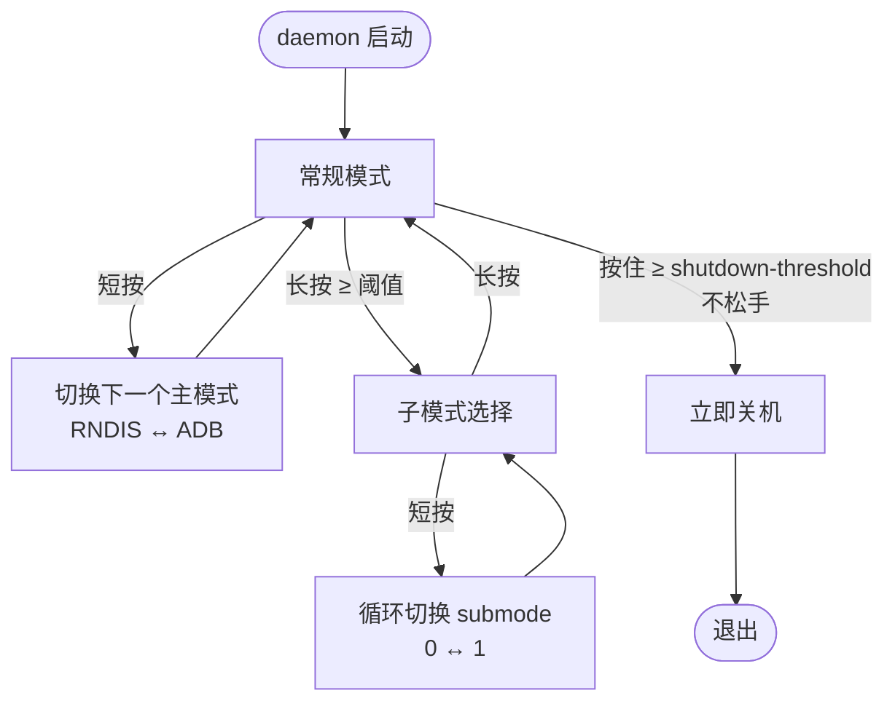

# miruku-wifi-stick-usb-switcher

通过 Wifi Stick 上的物理按钮切换 USB Gadget 模式,并可通过 IPC 查询/控制

> 要获取完整的配置流程, 以及更新更为及时的文档, 请参阅 <https://aka.lovemilk.top/notes/posts/deployment/wifistick/installation/>

## 工作原理

```
物理按钮 (evdev) ──> input 事件解析 (tap / long-tap) ──> 模式切换 ──> USB Gadget (configfs) + 网络配置
                                                                        │
                                                        RNDIS: 建 rndis 函数 → 绑 UDC → ip addr → dnsmasq DHCP
                                                        ADB:   挂载 functionfs → 启动 adbd
                                                        IPC:   unix socket(/tmp/<ident>.sock),cli ipc 子命令
```

- 模式序列由 `--gadget` 指定(可重复,顺序 = 切换顺序),默认 `rndis` → `adb`;条目可写 `name.N` 指定初始 submode(如 `--gadget rndis.1` 启动即从模式)。**短按**前进到下一个模式,**长按**进入/退出子模式选择(选择中短按切换子模式),切换即应用。
- 每次模式切换都会:清空现有函数 → 添加新模式函数 → 应用 → 更新 gadget。
- RNDIS 模式下 daemon 自行管理网络:让 NetworkManager 放弃该接口、按子模式配置网络(RNDIS 子模式见下节)。
- daemon 主循环与 IPC server 相互独立:IPC 异常会自动重建,不影响设备功能。

## 按键行为

按钮的状态转换:



- 短按切换在**子模式选择状态中**不切主模式,而是循环 submode(选择状态优先)。
- 关机流程优先级最高:一旦触发,停止除 INPUT Grab 外的一切事件处理。

| 事件              | 触发条件                                                     | 默认行为                                                                                                                                                                                                   |
| :---------------- | :----------------------------------------------------------- | :--------------------------------------------------------------------------------------------------------------------------------------------------------------------------------------------------------- |
| 短按 tap          | 按下时间 < `--long-tap-threshold`(500ms)                     | 未在选择中:切换到下一个模式;子模式选择中:切换子模式                                                                                                                                                        |
| 长按 long-tap     | 按下时间 ≥ `--long-tap-threshold`                            | 进入/退出子模式选择,LED 先关闭 `--submode-led-duration`(750ms) 提示                                                                                                                                        |
| 长按关机          | 按住时间 ≥ `--shutdown-threshold`(5s,须 > 长按阈值,`0` 禁用) | 立即关机,不等松开:LED 反向逐颗亮起(最后至最前,各 500ms),随后执行 `--shutdown-command`。默认按键是 KEY_RESTART,松开事件会触发系统级重启,poweroff 必须在按住期间调用;触发后停止一切事件处理(INPUT Grab 保持) |
| 连击 multiple-tap | `--multiple-tap-threshold`(500ms)内的连续 tap(双击等)       | 重新 effect 当前模式的 gadget:完整重建并重绑 UDC(LED 快闪过渡),等同重插,用于 USB 状态异常时手动恢复                                                                                                        |

- `--long-tap-immediately`(默认开启):按下时间一到阈值立即上报长按,无需等松开。
- `--multiple-tap-threshold` 设为负数可禁用连击。
- `--auto-confirm-threshold`(5s)已声明,尚未使用(预留)。

## 模式与子模式

模式(`RNDIS` / `ADB`)内部有子模式(submode),仅内存状态,切换子模式时**不重建 gadget**(重建会断开对端 RNDIS 网卡,Windows 侧需要重新枚举、ICS 重新就绪),直接在当前接口上重配网络。

| 模式  | 子模式  | 行为                                                                                                                         |
| :---- | :------ | :--------------------------------------------------------------------------------------------------------------------------- |
| RNDIS | 0(默认) | 网关模式:接口配 `--rndis-ip`,启动 dnsmasq 作 DHCP 服务器                                                                     |
| RNDIS | 1       | 从模式:udhcpc 探测上游 DHCP → 成功则按 `--rndis-client-ip` 模板配客户端 IP + 默认路由,上游 DNS 直写 `/etc/resolv.conf`(离开时还原);失败则静态接入 Windows ICS 网段 `192.168.137.<client_ip 末字节>/24` 并 UDP 探测 `.1:53`(ICS DNS 代理)验证(见下) |
| ADB   | 0       | ADB 模式,无子模式                                                                                                            |

- 从模式三级探测:DHCP 不可用(超时、掩码非连续、前缀 ≥ /30)→ 静态配 `192.168.137.xx/24`(xx 取 `--rndis-client-ip` 末字节)并 UDP 探测 `192.168.137.1:53`(Windows ICS 共享端固定地址,其 DNS 代理固定监听 53)——不用 ping 探测:实测从模式下主机能 ping 通 stick、stick ping 不通 `.1`(Win7 侧对入站 ICMP 无响应),而 UDP 探测只依赖 ICS 必有组件 → DNS 代理不通(host 既无 DHCP 也没开 ICS)才回退网关模式,保证 stick 始终可达。
- 子模式通过 `MaxSubmode()` 有界循环(`RNDIS` 0↔1),`enable()` 只会看到合法值。

## LED 显示

| 状态                   | 行为                                                          |
| :--------------------- | :------------------------------------------------------------ |
| 模式切换               | 快闪(`--led-blink-duration` on / `--led-blink-interval` off)  |
| 进入/退出子模式选择    | LED 先关闭 `--submode-led-duration` 提示,结束后显示子模式状态 |
| 子模式切换(选择中短按) | LED 关闭                                                      |
| 子模式状态             | 0 → 常亮;1 → 慢闪(500ms on / 500ms off)                       |
| `cli ipc toggle-led`   | 1 关闭所有 LED(立即生效,不等待下一次模式切换);2 恢复          |
| 长按关机触发           | 反向逐颗亮起 500ms(最后至最前),随后执行关机命令               |

## 构建

```bash
./build.sh [--debug] [arm64|amd64]   # 等价 make cli-amd64 / make cli-arm64
make cli-amd64                       # 本机编译
make cli-arm64                       # 交叉编译
make DEBUG=1 cli-amd64               # 带调试信息(-gcflags=all=-N -l)
```

本仓库不携带 libusbgx 源码或二进制:声明按公开 ABI 自写于 `core/usb/gadget/usbg_min.h`,链接期符号由 `core/usb/gadget/libusbgx.symbols`(从设备 so 导出的函数名清单)生成的**空桩 so**(soname `libusbgx.so.2`)提供 —— 运行时由设备预装的 `libusbgx.so.2` 接管。arm64 交叉用 zig(`-target aarch64-linux-gnu.2.31`,设备 glibc 较老)。

| 产物                    | 说明                                                                  |
| :---------------------- | :-------------------------------------------------------------------- |
| `build/amd64/cli`       | 本机编译(动态依赖 libusbgx.so.2)                                      |
| `build/arm64/cli`       | 交叉编译到设备架构(动态依赖 libusbgx.so.2,设备镜像预装)               |

## 部署

### 1. 安装运行时依赖

```bash
sudo apt install dnsmasq udhcpc iproute2
```

- `dnsmasq`:RNDIS 网关模式的 DHCP 服务器(USB host 从 stick 拿地址)
- `udhcpc`:RNDIS 从模式的 DHCP 探测(`enableClientMode` 用它向 Windows ICS/上游要租约)
- `iproute2`:`ip` 命令,配地址/路由的基础工具

> `cli` 动态依赖 `libusbgx.so.2`(configfs 操作库,本仓库不分发)。HandsomeMod 镜像预装;若缺失:`sudo apt install libusbgx`。

### 2. 安装二进制

方式 A:从 [GitHub Releases](https://aka.lovemilk.top/github/wifi-stick-usb-switcher/releases/latest) 下载对应架构的可执行文件(注意不要拿错 `amd64` 版本),解压得到 `cli`。

方式 B:自行交叉编译,见上文[构建](#构建),产物在 `build/arm64/cli`。

安装为系统命令(下文以 `/usr/local/bin/usb-switcher` 为例):

```bash
sudo install -m 0755 cli /usr/local/bin/usb-switcher
```

### 3. 配置启动脚本

> 参考 `scripts/start.sh.example`(参数化版本,可传 `$@` 覆盖参数)/ `scripts/test.sh.example`

按需修改参数,写入:

```path
/usr/local/lib/usb-switcher/start.sh
```

```bash
#!/usr/bin/env bash

set -euo pipefail

exec /usr/local/bin/usb-switcher daemon \
  --devnode /dev/input/event0 \
  --led /sys/class/leds/blue:wifi \
  --led /sys/class/leds/red:os \
  --led /sys/class/leds/green:internet \
  --config-fs /sys/kernel/config/usb_gadget/g1 \
  "$@"
```

授予可执行权限:

```bash
sudo chmod +x /usr/local/lib/usb-switcher/start.sh
```

> [!NOTE]
> - LED 与 `--gadget` 按序对应:第 i 个 LED = 第 i 个 gadget 条目,初始化时依次点亮(详见[按键行为](#按键行为)与[LED 显示](#led-显示))
> - `exec` 是必须的:daemon 不 fork,脚本必须以 `exec` 替换自身进程,systemd 才能直接管理 pid/信号

### 4. 创建 systemd 服务

```path
/etc/systemd/system/wifi-stick-usb-switcher.service
```

```ini
[Unit]
Description=wifi-stick-usb-switcher

[Service]
Type=simple
ExecStart=/usr/local/lib/usb-switcher/start.sh
Restart=on-failure
RestartSec=5s

[Install]
WantedBy=multi-user.target
```

重载并启用:

```bash
sudo systemctl daemon-reload
sudo systemctl enable --now wifi-stick-usb-switcher.service
```

> [!WARNING]
> 若固件自带 USB gadget 初始化服务(如 `mobian-usb-gadget.service` / `mobian-setup-usb-network.service`),须先禁用,否则会与 daemon 抢 configfs/接口:
>
> ```bash
> sudo systemctl disable --now mobian-usb-gadget.service
> sudo systemctl disable --now mobian-setup-usb-network.service
> ```

### 5. 验证

```bash
systemctl status wifi-stick-usb-switcher
journalctl -u wifi-stick-usb-switcher -f   # 看到 "INFO daemon started" + 模式切换日志
/usr/local/bin/usb-switcher ipc toggle-led 0   # 与 daemon 的 IPC 握手,输出 "led: on"
```

### 6. 调试 / 前台运行

不想装 systemd 时,把二进制传到设备(例如 `scp`,或参考 `scripts/mutagen-create-sync-arm64.sh.example` 做自动同步),前台运行:

```bash
./cli daemon --devnode /dev/input/event0 \
  --led /sys/class/leds/blue:wifi \
  --led /sys/class/leds/red:os \
  --led /sys/class/leds/green:internet \
  --config-fs /sys/kernel/config/usb_gadget/g1 \
  --ifname usb0
```

gdbserver 调试示例见 `scripts/test-gdbserver.sh.example`。`tests/virtual-button/virtual_button.py` 是虚拟按键注入工具,用于无实体按键时测试。

全部参数见[命令行参数](#命令行参数);IPC 命令见[`cli ipc`](#cli-ipc-command-args)。

## 命令行参数

### `cli daemon [flags]`

| 参数                       | 默认值                             | 说明                                                |
| :------------------------- | :--------------------------------- | :-------------------------------------------------- |
| `-d, --devnode`            | 必填                               | 按键设备节点,如 `/dev/input/event0`                 |
| `--long-tap-immediately`   | `true`                             | 按下时间达到阈值立即上报长按,不等松开               |
| `--long-tap-threshold`     | `500ms`                            | 长按阈值                                            |
| `--multiple-tap-threshold` | `500ms`                            | 连击阈值,< 0 禁用                                   |
| `--auto-confirm-threshold` | `5s`                               | 预留,未使用                                         |
| `-l, --led`                | —                                  | LED 节点,可重复,如 `-l /sys/class/leds/blue:wifi`   |
| `--gadget`                 | `rndis` `adb`                      | gadget 序列,可重复,顺序 = 切换顺序;`name[.submode]`,如 `--gadget rndis.1 --gadget adb`(启动为 RNDIS 从模式,短按切 ADB);第 i 个 gadget 对应第 i 个 `--led` |
| `--led-blink-duration`     | `100ms`                            | 模式切换快闪的亮时长                                |
| `--led-blink-interval`     | `300ms`                            | 模式切换快闪的灭时长                                |
| `--submode-led-duration`   | `750ms`                            | 进入/退出子模式选择时 LED 的关闭提示时长            |
| `-c, --config-fs`          | `/sys/kernel/config/usb_gadget/g1` | configfs 路径(不存在时由 libusbgx 创建)             |
| `--rndis-device-mac`       | `02:12:34:56:78:9a`                | 设备侧 RNDIS 接口 MAC                               |
| `--rndis-host-mac`         | `02:98:76:54:32:10`                | 电脑侧可见的 MAC                                    |
| `-a, --rndis-ip`           | `10.22.33.1/24`                    | RNDIS 接口 IP(带前缀),DHCP 池由此自动推导           |
| `--rndis-client-ip`        | `0.0.0.33`                         | 从模式客户端 IP:模板(DHCP 租约时 0 字节取上游网段字节),末字节用于 ICS 静态探测(`192.168.137.x`) |
| `--rndis-client-timeout`   | `5s`                               | 从模式总超时(等网卡 + DHCP 探测)                    |
| `-i, --rndis-ifname`       | `usb0`                             | RNDIS 接口名,`ip link` 可查                         |
| `--rndis-qmult`            | `8`                                | usb ifname qmult(队列长度乘数),0 不写               |
| `--rndis-serial-number`    | `wifi-stick-miruku`                | RNDIS 模式的 USB 序列号字符串                       |
| `--rndis-manufacturer`     | `wifi-stick`                       | RNDIS 模式的制造商字符串                            |
| `--rndis-product`          | `RNDIS Ethernet`                   | RNDIS 模式的产品字符串                              |
| `--adb-serial-number`      | `wifi-stick-miruku`                | ADB 模式的 USB 序列号字符串                         |
| `--adb-manufacturer`       | `Google`                           | ADB 模式的产品字符串                                |
| `--adb-product`            | `ADB Gadget`                       | ADB 模式的产品字符串                                |
| `--adb-env`                | `TERM=xterm-256color`              | adbd 附加环境变量,可重复                            |
| `--dnsmasq-arg`            | —                                  | 附加 dnsmasq 参数,可重复,见下节                     |
| `--ipc-share`              | `false`                            | 允许其他用户访问 IPC(unix socket 权限放宽)          |
| `--tick-rate`              | `50ms`                             | daemon 事件循环 tick 间隔                           |
| `--shutdown-threshold`     | `5s`                               | 长按关机阈值,必须 > `--long-tap-threshold`,`0` 禁用 |
| `--shutdown-command`       | `poweroff`                         | 长按关机时执行的命令                                |
| `--shell`                  | `/bin/bash`                        | 执行关机命令的 shell,`$SHELL` 环境变量优先          |

### `cli ipc <command> [args]`

通过 unix socket(`/tmp/<PROJECT_IDENT>.sock`)与 daemon 交互。

| 命令         | 参数 | 说明               | 输出                   |
| :----------- | :--- | :----------------- | :--------------------- |
| `toggle-led` | `0`  | 查询当前 LED 状态  | `led: on` / `led: off` |
| `toggle-led` | `1`  | 关闭 LED(立即生效) | `led: off`             |
| `toggle-led` | `2`  | 开启 LED(立即生效) | `led: on`              |

| 参数                | 默认值 | 说明              |
| :------------------ | :----- | :---------------- |
| `-t, --timeout`     | `10s`  | 等待 IPC 响应超时 |
| `--connect-timeout` | `5s`   | 连接与握手超时    |
| `--dial-retry`      | `1s`   | 连接重试间隔      |

```bash
./cli ipc toggle-led 0   # 查询
./cli ipc toggle-led 1   # 关灯
./cli ipc toggle-led 2   # 开灯
```

`cli version` 输出编译信息(`CommitHash` / `BuildTime`)。

## IPC 说明

- 连接不加密(daemon 端 `ServerConfig` 零值,cli 端显式对齐,否则握手必失败)。
- golang-ipc 库的 server 是一次性的:一次握手失败(旧 cli 二进制、cli 半途退出)会关闭 listener。daemon 用 supervisor 循环重建,任何时刻都尽量提供服务;cli 侧也先等握手完成(`Connected`)再发请求,不再撞 `Connecting` 竞态。
- 握手失败/连接异常只影响 IPC,daemon 主循环(按键、LED、USB)不受影响。

## dnsmasq 自定义

默认参数在 RNDIS 接口上启动 dnsmasq:DHCP 池从本机 IP 之后到子网广播地址之前,提供网关(DHCP option 3),`--port=0` 关闭 DNS(避免与系统 dnsmasq 冲突)。启动时带 `--conf-file=/dev/null`,**不加载系统 dnsmasq 配置**(否则 OpenWrt/出厂配置里的 DHCP 范围,如 192.168.68.x,会被合并进本实例)。

自定义参数通过 `--dnsmasq-arg` 传入,**注意必须使用 `=` 形式**(空格分隔的值以 `--` 开头会被 go-arg 当作新参数解析):

```bash
# 附加 hosts 文件(推荐;即使默认开启了 --no-hosts,--addn-hosts 文件仍然加载)
--dnsmasq-arg=--addn-hosts=/etc/wifi-stick/hosts

# 为指定 MAC 固定 IP
--dnsmasq-arg=--dhcp-host=02:98:76:54:32:10,10.22.33.99

# 覆盖标量默认值(标量选项取最后一次出现):开启 DNS
--dnsmasq-arg=--port=53
```

参数顺序:服务默认值 → 用户自定义 → 控制参数(`--interface` / `--bind-interfaces` / `--pid-file` 永远最后)。

限制:

- `--no-resolv` / `--no-hosts` 无法被覆盖(dnsmasq 没有对应的正向开关);需要 hosts 请用 `--addn-hosts`。
- `--dhcp-range` 是累积型选项,传入新的 range 是追加而不是替换。
- 控制参数(`--interface` 等)不能被覆盖,否则进程追踪(pid 文件)会失效。

## 技术细节

- **configfs 操作走 libusbgx(cgo)**:函数/配置/属性/OS 描述符的创建与写入经 cgo 调用 `libusbgx.so.2`(设备预装,仓库不分发其源码/二进制;仅自写 ABI 声明 `usbg_min.h` + 符号名清单),不再 exec 外部 `gc` 二进制。libusbgx 的属性写在绑定前完成,不存在"link 后属性被锁定(EBUSY)"的时序问题。
- **ifname 属性必须写模式**:内核(≥5.12,`gether_set_ifname`)要求 ifname 写成接口模式(`usb%d`),写具体名字(`usb0`)会返回 `-EINVAL`。libusbgx 把 ifname 视为只读,程序在绑定前直写 configfs;绑定后内核按空闲号分配真实接口名,程序读回属性解析。
- **configfs 不能创建文件**:写一个不存在的属性路径返回 EACCES,写入必须是 `exist_only` 语义(先 stat 再写)。
- **NetworkManager 让位**:向 `/etc/NetworkManager/conf.d/<PROJECT_IDENT>.conf` 写持久 unmanaged 配置(NM 启动加载早于 usb0 出现,注册即 unmanaged),写入后 SIGHUP 重载并校验,失效时用 `nmcli device set ... managed no` 兜底;NM 接管时会把 usb0 当 DHCP client,永远拿不到地址还会清掉配置的 IP。
- **从模式 DNS 直写 `/etc/resolv.conf`**:resolvconf tail 方案在该设备无效(resolv.conf 不重新聚合),改为写前备份原状(symlink 也处理)、离开从模式时还原。已知限制:NetworkManager 重写 resolv.conf 会覆盖条目。
- **进程管理**:adbd 和 dnsmasq 都通过 pid 文件 + `/proc/<pid>/cmdline` 校验来追踪,pid 复用也不会误杀无关进程;不会无差别 killall。
- **LED 失败容错**:LED 节点初始化失败(systemd 开机时序 sysfs 未就绪)时该槽位留 nil,所有遍历判空跳过,daemon 照常运行。
- **子模式有界**:`UsbGadgetFunction` 暴露 `MaxSubmode()`(`RNDIS`=1),切换用 `(submode+1) % (MaxSubmode()+1)` 循环,防止无限递增撞上 `enable()` 不认识的值。
- **RNDIS 枚举对齐真实 Android 手机 USB 共享**:`idVendor/idProduct` 固定 `0x18d1:0x4ee4`(Google Nexus/Pixel tether+debug,Windows 有现成驱动映射)、设备级 class 0/0/0(分类全在接口级;此前写 `EF/02/01` 时 Win7 开 ICS 后 RNDIS 驱动空指针蓝屏,手机不会)、`bcdDevice 0x0223`、`MaxPower 500mA`,并带 MS OS Descriptor(`compatible_id "RNDIS"` + `sub_compatible_id "5162001"`,Windows 免 INF 自动加载 usb8023/rndismp 驱动,没有 os_desc 时设备管理器显示"其他设备"代码 28)。设备枚举为双接口:Wireless(RNDIS 通信)+ CDC Data。

## 目录结构

```
cmd/cli.go              # CLI 入口(go-arg:daemon / ipc / version 子命令)
core/daemon/            # 守护进程主循环、模式切换、IPC supervisor
core/daemonipc/         # 反射式 IPC 框架(handler 分发 / payload 解析)
core/input/             # evdev 按键读取与 tap/long-tap/multiple-tap 语义
core/led/               # LED 状态显示
core/usb/               # USB gadget 控制器(configfs)与 RNDIS / ADB 功能
core/base/              # 路径检查、configfs 写入工具
docs/tools/gc.md        # gc 工具参考文档
scripts/*.example       # 部署/调试脚本示例
tests/virtual-button/   # 虚拟按键注入工具
```

## 依赖的工具

| 工具                    | 系统预装 | 简介                                                       | URL                               |
| :---------------------- | :------: | :--------------------------------------------------------- | :-------------------------------- |
| `libusbgx.so.2`         |    是    | configfs 操作库(设备预装;缺失可 `apt install libusbgx`)   | https://github.com/libusbgx/libusbgx |
| `dnsmasq`               |    否    | RNDIS 接口的 DHCP 服务器(`apt install dnsmasq`)            |                                   |
| `udhcpc`                |    否    | RNDIS 从模式的 DHCP 探测(`apt install udhcpc`)             |                                   |
| `iproute2`              |    否    | `ip` 命令,配地址/路由(`apt install iproute2`)              |                                   |
| `adbd`                  |    是    | ADB 模式下的 device 端守护进程                             |                                   |
| `aarch64-linux-gnu-gcc` |    否    | 交叉编译 arm64 时需要                                      |                                   |

## License

主要文件使用使用 [BSD 3-Clause](LICENSE)

程序运行时动态链接设备预装的 [libusbgx](https://github.com/libusbgx/libusbgx)(LGPL-2.1-or-later)**系统库**;本仓库不分发其源码或二进制,仅包含自写的 ABI 声明(`core/usb/gadget/usbg_min.h`)与函数名清单(`core/usb/gadget/libusbgx.symbols`),链接由本地生成的空桩完成
